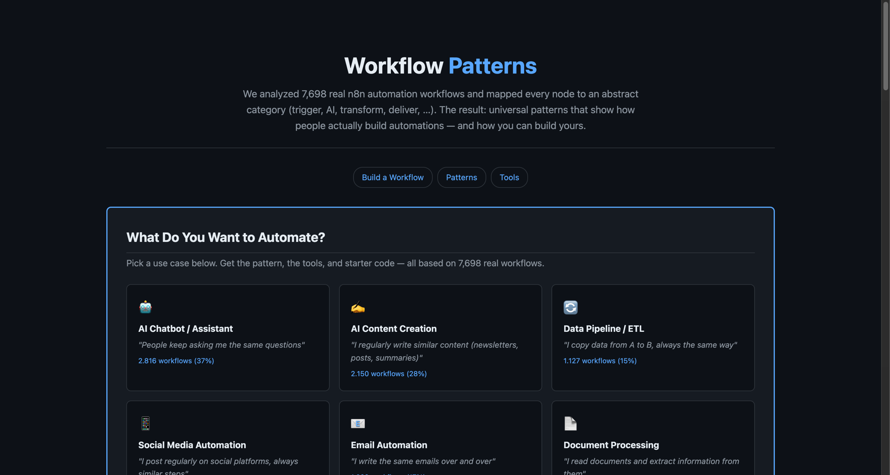
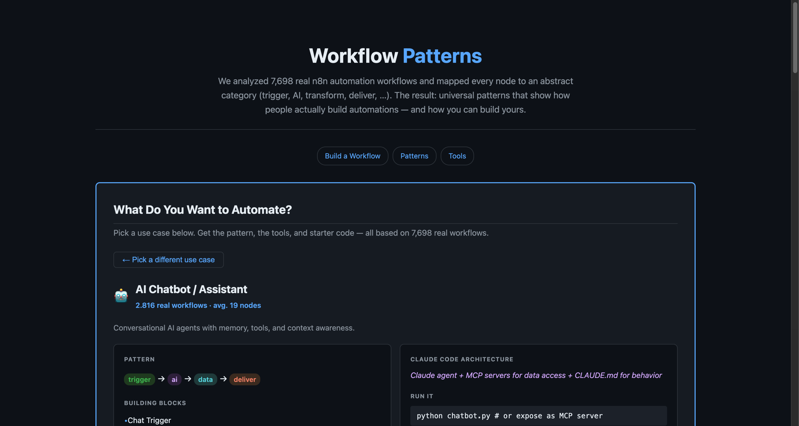

<p align="center">
  <h1 align="center">Workflow Patterns</h1>
  <p align="center">
    What do 7,698 real-world automation workflows have in common?<br/>
    We extracted the universal patterns — and turned them into explorable blueprints.
  </p>
  <p align="center">
    <a href="LICENSE"></a>
    <a href="https://docs.anthropic.com/en/docs/claude-code"></a>
    
    
  </p>
</p>

---

> We parsed 7,698 [n8n](https://n8n.io) workflow JSONs, mapped 80+ node types to 9 abstract categories, and extracted the recurring patterns behind everyday automation. The result: an **interactive explorer** with blueprints for 12 use cases, and an **MCP server** that lets Claude Code query the pattern database directly.

---

**[Live Explorer](https://janrummel.github.io/workflow-patterns/)** | [View locally](#view-locally)

[](https://janrummel.github.io/workflow-patterns/)

## The Idea

People build automation workflows every day — in n8n, Make, Zapier, or with code. The tools differ, but the **patterns are universal**:

```
trigger -> ai -> deliver        (AI writes content, sends it somewhere)
trigger -> transform -> data    (data arrives, gets cleaned, gets stored)
trigger -> api -> logic -> api  (two systems talk to each other)
```

These patterns repeat across thousands of workflows. If you know the pattern, you know the architecture — regardless of which tools you use.

**This project extracts those patterns from real data and makes them actionable.**

## Quick Start

```bash
git clone https://github.com/janrummel/workflow-patterns
cd workflow-patterns
uv sync

# Generate the interactive site
uv run python scripts/generate_site.py
open docs/index.html

# Or use as MCP server with Claude Code
claude --mcp-config mcp.json
```

## Key Findings

| Insight | Detail |
|---------|--------|
| **7,698** workflows analyzed | From the [n8nworkflows.xyz](https://github.com/nusquama/n8nworkflows.xyz) public archive |
| **2,592** unique patterns | Distinct category sequences found across all workflows |
| **12 use case clusters** | AI Chatbot, Content Creation, Data Pipeline, Email Automation, and more |
| Most common pattern | `trigger -> transform -> api -> logic` (187 workflows) |
| AI is mainstream | 45%+ of workflows include at least one AI node |
| Most workflows are small | 4-6 nodes is the sweet spot — you don't need 20 steps |

## Interactive Explorer

The site lets you pick a use case and instantly get a complete blueprint:

- The **pattern** as an abstract step sequence
- **Building blocks** needed to implement it
- **Tools & services** grouped by category — showing alternatives, not just the most popular
- **Starter code** in Python with syntax highlighting
- **Claude Code architecture** recommendation

[](https://janrummel.github.io/workflow-patterns/)

### View locally

```bash
open docs/index.html
```

## How It Works

```
n8n JSON files (7,698 workflows)
    |
    v  parse
Workflow objects (nodes + edges)
    |  handles inconsistent JSON formats: null connections,
    |  string-wrapped lists, missing fields
    v  categorize
Abstract graphs (80+ node types -> 9 categories)
    |  "lmChatOpenAi" -> ai
    |  "googleSheets"  -> data
    |  "gmail"         -> deliver
    v  analyze
Patterns, statistics, use case clusters
    |  BFS graph traversal for pattern extraction
    |  Jaccard similarity for workflow matching
    v  translate
Claude Code architectures
    |  pattern -> MCP servers + agents + scripts
    v  serve
Interactive site  +  MCP server for Claude Code
```

## The 9 Categories

Every node type maps to one abstract category. This is what makes patterns universal — the specific tool doesn't matter, only its role in the workflow.

| Category | What it represents | Example nodes | Claude Code equivalent |
|----------|-------------------|---------------|----------------------|
| **trigger** | Starts the workflow | scheduleTrigger, webhook, formTrigger | Cron job, file watcher |
| **ai** | LLM processing | openAi, lmChatOpenAi, agent | Claude agent |
| **transform** | Reshape data | set, code, filter, aggregate | Python script |
| **deliver** | Send output | gmail, slack, telegram | MCP server |
| **data** | Read/write storage | googleSheets, postgres, airtable | MCP server |
| **api** | Call external APIs | httpRequest | MCP server |
| **logic** | Branch, route, merge | if, switch, merge | Claude skill |
| **storage** | File operations | googleDrive, s3 | MCP server |

## MCP Server

The project includes an MCP server that exposes pattern analysis to Claude Code. Connect it and ask natural language questions about automation patterns.

```bash
claude --mcp-config mcp.json
```

Then ask Claude:

> "I want to build a workflow that fetches news articles weekly, summarizes them with AI, and sends a digest by email."

Claude will search the pattern database, find matching workflows, and suggest an architecture:

```
**Query:** Send a weekly AI summary of news articles by email
**Detected categories:** trigger, ai, deliver

**Matching workflows:**
- [80% match] Weekly AI Newsletter
  Pattern: trigger -> ai -> transform -> deliver
- [60% match] RSS Digest Bot
  Pattern: trigger -> api -> ai -> deliver

**Suggested pattern:** trigger -> ai -> deliver
```

| Tool | What it does |
|------|-------------|
| `search_patterns(query)` | Find patterns matching a natural language description |
| `suggest_implementation(pattern)` | Get Claude Code architecture for a pattern |
| `list_categories()` | Show category frequency and common connections |
| `show_all_patterns()` | List all unique patterns ranked by frequency |

## Runnable Examples

Each example implements a real workflow pattern with current tools — not just a blueprint, but working code you can run.

| Example | Pattern | What it does |
|---------|---------|-------------|
| [AI Content Creation](examples/ai-content-creation/) | `api -> ai -> transform -> deliver` | Fetches RSS feeds, summarizes with Claude, saves a markdown digest. Interactive selection from 60 curated feeds across 6 categories. |
| [AI Chatbot](examples/ai-chatbot/) | `trigger -> ai -> data -> deliver` | Streaming terminal chat with 5 persona presets and conversation persistence |
| [Email Automation](examples/email-automation/) | `trigger -> transform -> deliver` | Template-based emails with 5 presets, HTML rendering, and optional SMTP delivery |

```bash
cd examples/ai-content-creation
uv sync
cp .env.example .env          # add your ANTHROPIC_API_KEY
uv run python run.py           # interactive feed selection
uv run python run.py --feeds https://hnrss.org/newest?points=100  # or custom
```

More examples coming: Data Pipeline, Social Media Automation, and more.

## Development

```bash
uv run pytest -v          # 97 tests across 20 modules
uv run ruff check .       # Lint
```

## Project Structure

```
workflow-patterns/
├── src/workflow_patterns/
│   ├── models.py                  # Node, Edge, Workflow, Pattern + 80+ node type mappings
│   ├── parser/parse.py            # Robust n8n JSON parser (handles format inconsistencies)
│   ├── patterns/analyzer.py       # Pattern extraction, node stats, Jaccard similarity
│   ├── translator/claude_code.py  # Pattern -> Claude Code architecture mapping
│   └── mcp_server/server.py       # 4 MCP tools for Claude Code integration
├── examples/
│   ├── ai-chatbot/                # Runnable example (22 tests, streaming API, 5 personas)
│   ├── ai-content-creation/       # Runnable example (30 tests, Claude API, 60 curated feeds)
│   └── email-automation/          # Runnable example (25 tests, 5 templates, HTML + SMTP)
├── scripts/
│   └── generate_site.py           # Static site generator with interactive wizard
├── docs/
│   └── index.html                 # Generated GitHub Pages site
├── tests/                         # 20 unit tests across 4 modules
├── evals/                         # 10 evaluation test cases
├── data/sample_workflows/         # 15 sample n8n workflows for development
├── .github/workflows/ci.yml       # CI: lint + test on push/PR
└── mcp.json                       # MCP server config for Claude Code
```

## Data Source

Workflow data from [n8nworkflows.xyz](https://github.com/nusquama/n8nworkflows.xyz), an independent archive of 7,000+ public n8n workflow templates. The sample dataset includes 15 workflows for development; the full dataset (7,698 workflows) can be placed in `data/all_workflows/`.

## License

[MIT](LICENSE)
